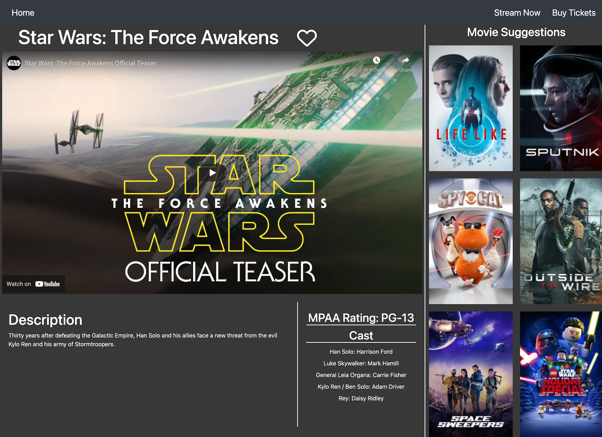
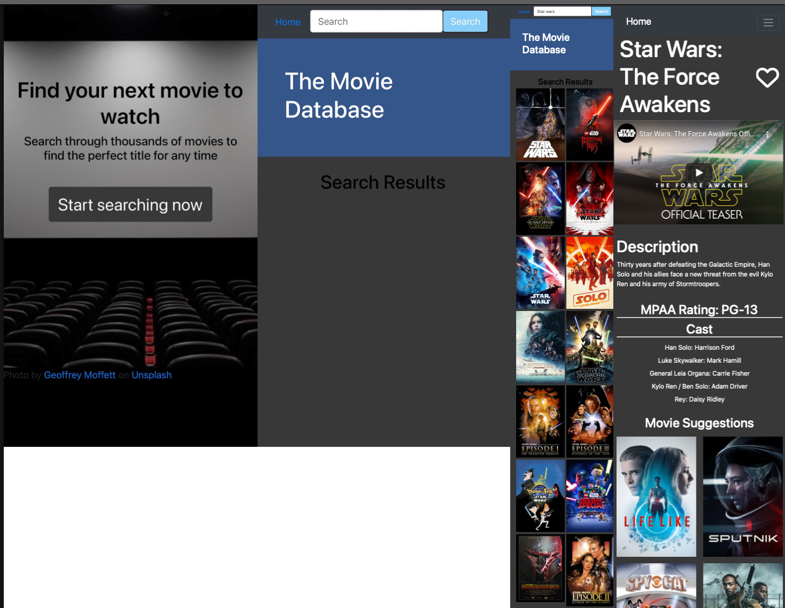

# The Movie Database

-----
## Table of Content

- [Description](#description)
- [Images](#images)
- [Responsive Layout Image](#responsive-layout-image)
- [Site URL](#site-url)
- [GitHub Repository](#github-repository)
- [Authors](#authors)  
- [Technologies Used](#technologies-used) 
- [License](#license)

-----
## Description:

The Movie Database is a central location for a user to search for a movie title and get presented with the summary of the movie, top cast members, MPAA rating, Movie Trailer, as well as other movie suggestions.  

-----
## Images:

----
## Responsive Layout image:

-----
## Site URL:

- [The Movie Database](https://ksjefferies.github.io/The-Movie-Database/)

## Github Repository:

- [Github Repository for The Movie Database](https://github.com/ksjefferies/The-Movie-Database)

## Authors:

- [Kelly Jefferies](https://github.com/ksjefferies)
- [Matt Jackson](https://github.com/Matt4292)
- [Rohit Balachandar](https://github.com/Robala98)

## Technologies Used:

  

## License:

