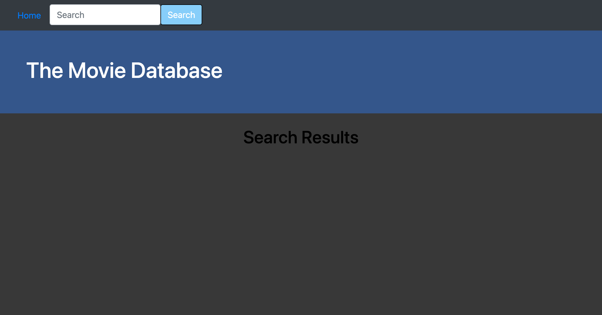
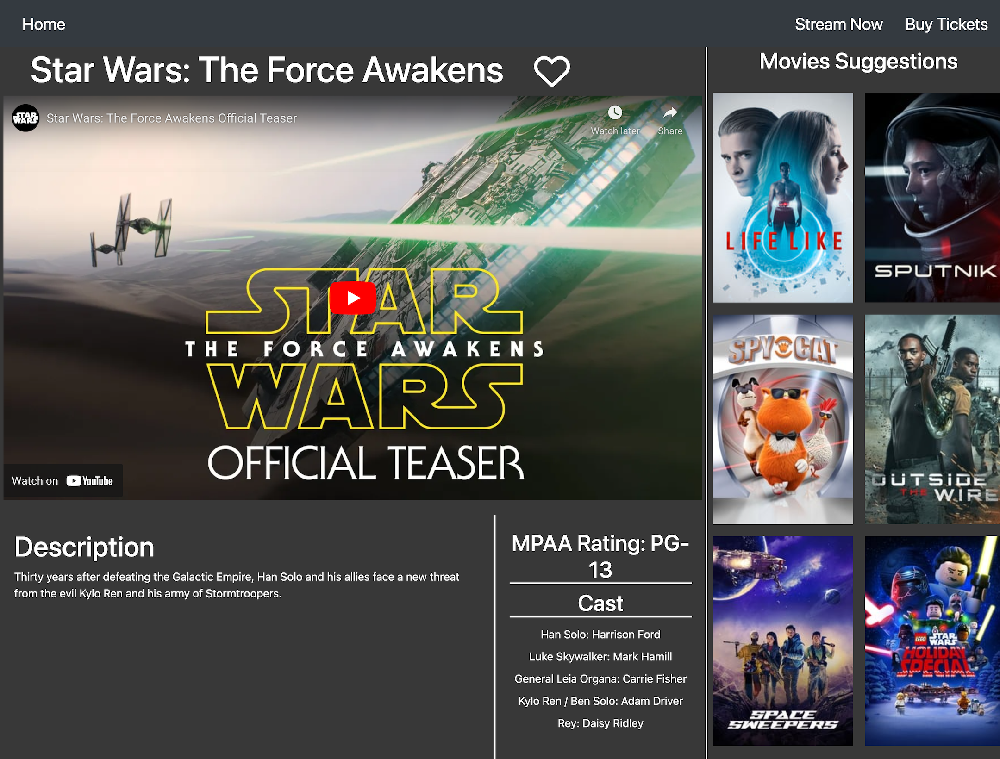

# Project-1

## Objective
-----
In this project, we did the following:

- User is initially presented with a landing page that describes the site.
- Once the user clicks the button in the center of the screen they are taken to a search page
- User will enter the movie title of his choice and all movies with that name will appear.
- Users selected movies will appear as movie poster thumbnails.
- User can click on the movie thumbnail that matches his query and is taken to a detailed page of the movie
- On the detailed movie page, user will get facts for the movie including:
    - Movie Title
    - Cast
    - Rating
    - Movie description
    - Movie trailer
    - User can add movie to favorite list, within local storage
-----

## Final screenshots of pages

-----
## Links for Github Repository and final public page

- [Github Repository for Project-1](https://github.com/ksjefferies/project-1)

- [Project-1 final page](https://ksjefferies.github.io/project-1/)

# Contributions:
- Kelly
- Matt
- Rohit